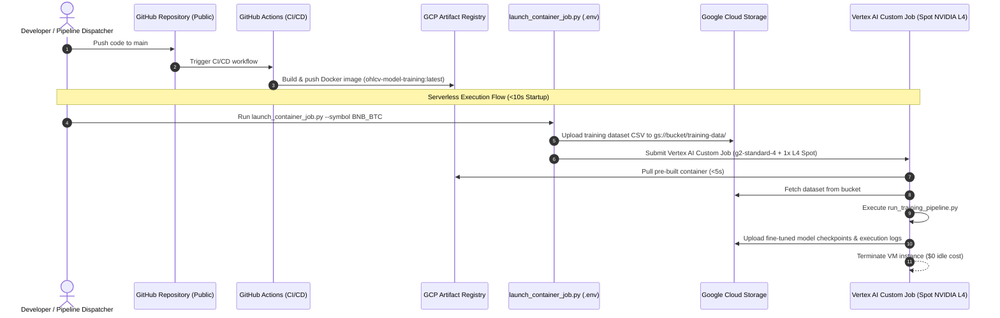
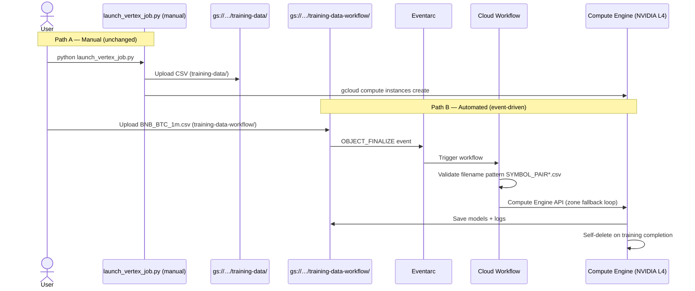
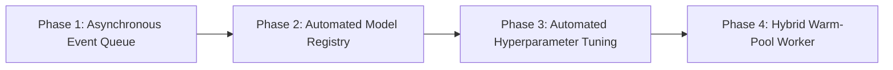

# EpochQuant Kronos ML Training

[](LICENSE)
[](https://www.python.org/)
[](https://pytorch.org/)
[](https://cloud.google.com/vertex-ai)
[](https://www.nvidia.com/en-us/data-center/l4/)
[](https://podman.io/)
[](SECURITY.md)

Fine-tuning the **Kronos** time-series foundation model on cryptocurrency OHLCV market data using an ultra-low cost, **Serverless Containerized Architecture** on Google Cloud Platform (GCP).

---

## Executive Summary & Mission

Financial time-series forecasting requires high-capacity foundation models adapted to heavy-tailed price distributions, sudden structural volatility breaks, and varying market liquidity.

**EpochQuant Kronos ML Training** provides a production-grade pipeline for fine-tuning the Kronos architecture (Tokenizer & Predictor) with **$0 idle infrastructure cost** and **sub-10-second container startup times**. By decoupling container compilation from GPU runtime execution, this repository enables seamless scaling from on-demand single-asset fine-tuning to high-frequency automated execution (1+ training jobs per minute) utilizing **NVIDIA L4 Spot GPUs**.

---

## Serverless Container Architecture

The pipeline leverages a containerized serverless workflow:

1. **Continuous Deployment (CI/CD):** Pushes to `main` trigger GitHub Actions to build an optimized PyTorch GPU container image and push it to **GCP Artifact Registry**.
2. **Sub-10s Job Dispatch:** When a training job is requested, `launch_container_job.py` uploads the dataset to Google Cloud Storage (GCS) and triggers a **Vertex AI Custom Training Job**.
3. **Spot GPU Execution:** Vertex AI pulls the pre-built container image instantly, executes fine-tuning on a Spot NVIDIA L4 GPU, saves models/logs to GCS, and immediately terminates the infrastructure to eliminate idle billing.



---

## Pipeline Setup & Deployment Guide

Follow these concise steps to configure and run the training pipeline.

### Step 1: Clone Repository & Configure Environment

Clone the repository and copy the environment configuration template:

```bash
git clone https://github.com/epochquant/ml-training-ohlcv-model.git
cd ml-training-ohlcv-model
cp .env.example .env
```

Edit `.env` with your GCP project details:

```env
GCP_PROJECT_ID=dev-gcp-project-id
GCP_REGION=us-central1
GCP_SERVICE_ACCOUNT=ohlcv-model-training-sa@dev-gcp-project-id.iam.gserviceaccount.com
GCS_BUCKET_NAME=gs://epochquant-training
ARTIFACT_REGISTRY_IMAGE=us-central1-docker.pkg.dev/dev-gcp-project-id/kronos-ml/ohlcv-model-training:latest
```

### Step 2: Local Container Build & Testing (Podman / Docker)

Test container compilation and unit tests locally using **Podman** (or Docker):

```bash
# Build container image locally with Podman
podman build -t ohlcv-model-training:local .

# Run regression tests inside the container
podman run --rm ohlcv-model-training:local pytest
```

### Step 3: Configure GCP Workload Identity Federation (GitHub Actions OIDC)

To enable keyless OIDC authentication between GitHub Actions and Google Cloud, set up a Workload Identity Pool and Provider in GCP:

#### 1. Enable IAM Credentials API
```bash
gcloud services enable iamcredentials.googleapis.com --project="YOUR_GCP_PROJECT_ID"
```

#### 2. Create Workload Identity Pool
```bash
gcloud iam workload-identity-pools create "github-pool" \
  --project="YOUR_GCP_PROJECT_ID" \
  --location="global" \
  --display-name="GitHub Actions Pool"
```

#### 3. Create OIDC Provider
```bash
gcloud iam workload-identity-pools providers create-oidc "github-provider" \
  --project="YOUR_GCP_PROJECT_ID" \
  --location="global" \
  --workload-identity-pool="github-pool" \
  --display-name="GitHub Provider" \
  --attribute-mapping="google.subject=assertion.sub,attribute.actor=assertion.actor,attribute.repository=assertion.repository,attribute.repository_owner=assertion.repository_owner" \
  --attribute-condition="assertion.repository_owner == 'YOUR_GITHUB_ORG'" \
  --issuer-uri="https://token.actions.githubusercontent.com"
```

#### 4. Authorize Service Account Impersonation
```bash
# Get your numeric GCP Project Number
PROJECT_NUMBER=$(gcloud projects describe "YOUR_GCP_PROJECT_ID" --format="value(projectNumber)")

gcloud iam service-accounts add-iam-policy-binding "YOUR_SERVICE_ACCOUNT@YOUR_GCP_PROJECT_ID.iam.gserviceaccount.com" \
  --project="YOUR_GCP_PROJECT_ID" \
  --role="roles/iam.workloadIdentityUser" \
  --member="principalSet://iam.googleapis.com/projects/${PROJECT_NUMBER}/locations/global/workloadIdentityPools/github-pool/attribute.repository/YOUR_GITHUB_ORG/YOUR_REPO_NAME"
```

#### 5. Retrieve Provider Resource Name
```bash
gcloud iam workload-identity-pools providers describe "github-provider" \
  --project="YOUR_GCP_PROJECT_ID" \
  --location="global" \
  --workload-identity-pool="github-pool" \
  --format="value(name)"
```

#### 6. Configure GitHub Secrets
In your GitHub repository, go to **Settings > Secrets and variables > Actions** and set the following repository secrets:

- `GCP_WORKLOAD_IDENTITY_PROVIDER`: Output string from Step 5 (`projects/.../providers/github-provider`)
- `GCP_SERVICE_ACCOUNT`: `YOUR_SERVICE_ACCOUNT@YOUR_GCP_PROJECT_ID.iam.gserviceaccount.com`
- `GCP_PROJECT_ID`: `YOUR_GCP_PROJECT_ID`
- `GCP_REGION`: `YOUR_GCP_REGION` (e.g., `us-central1`)
- `ARTIFACT_REPOSITORY`: `YOUR_ARTIFACT_REPOSITORY_NAME`

### Step 4: CI/CD & GCP Artifact Registry Deployment

Continuous Integration is pre-configured via [.github/workflows/docker-build-push.yml](.github/workflows/docker-build-push.yml). Upon pushing commits to `main`, GitHub Actions automatically authenticates via Workload Identity, builds the container, and pushes the tagged image to GCP Artifact Registry:

```bash
git add .
git commit -m "feat: optimize tokenizer quantization codebook"
git push origin main
```

### Step 5: Dispatch Serverless Training Job

Execute training on GCP using the containerized launcher script:

```bash
python launch_container_job.py --csv data/processed/bnb_btc_1m.csv --symbol BNB_BTC
```

The script will:
1. Upload `bnb_btc_1m.csv` to `gs://epochquant-training/training-data/`.
2. Provision a **Vertex AI Custom Training Job** with a **Spot NVIDIA L4 GPU** (`g2-standard-4`).
3. Execute Phase B (Tokenizer) and Phase C (Predictor) fine-tuning in <10 seconds container boot time.
4. Export saved checkpoints to `gs://epochquant-training/models/`.

---

## Data Processing Pipeline

The repository includes an interactive CLI tool (`data/convert_json_to_csv.py`) to prepare and clean raw JSON/CSV OHLCV market data for the Kronos model. 

### Key Features:
- **Interactive CLI:** Guides you through input paths, output paths, and Google Cloud Storage (GCS) upload configurations.
- **Data Standardization:** Converts Unix timestamps, sorts chronologically, and removes duplicates.
- **Structural Break Segmentation:** Cleans data by filtering out problematic segments based on:
  - **Price Jumps:** Splits segments when price changes exceed a threshold.
  - **Illiquidity:** Splits segments during prolonged periods of near-zero volume.
  - **Stagnation:** Splits segments when closing prices remain constant for too long.
- **GCS Integration:** Optional automated uploading of the cleaned CSV directly to a GCS bucket using Application Default Credentials (ADC) or a specific Service Account key.

**Usage:**
```bash
python data/convert_json_to_csv.py
```

---

## Automated Event-Driven Training Trigger (Cloud Workflows + Eventarc)

In addition to the manual [`launch_vertex_job.py`](launch_vertex_job.py) launcher, the repository ships a **serverless, zero-idle-cost, event-driven trigger** that automatically launches a GPU training VM whenever a dataset CSV is uploaded to a dedicated GCS folder.

> **Manual script is preserved.** `launch_vertex_job.py` uploads to `training-data/` and is completely isolated from this trigger. Double-job execution is architecturally impossible — the workflow only listens on `training-data-workflow/`.

### How It Works

1. A dataset CSV (e.g. `BNB_BTC_1m.csv`) is uploaded to `gs://epochquant-training/training-data-workflow/`.
2. **Eventarc** detects the `OBJECT_FINALIZE` event and triggers a **Cloud Workflow**.
3. The Workflow validates the filename pattern (`SYMBOL_PAIR*.csv`) — non-conforming files are silently skipped with no VM created.
4. The Workflow derives the trading symbol, builds the startup script, and calls the **Compute Engine REST API** to provision an NVIDIA L4 GPU VM.
5. Zone fallback is built into the workflow — it automatically retries across `us-central1-b → us-central1-a → us-central1-c → us-east1-b → us-east1-c` if GPU capacity is constrained.
6. The VM trains, saves outputs to `gs://epochquant-training/models/`, backs up logs, and **self-deletes** on completion.



### Filename Convention (Required)

Only files matching the pattern `SYMBOL_PAIR*.csv` trigger a job. Files with non-conforming names are silently skipped — no VM is created.

| Upload path | Symbol derived | Job triggered? |
|---|---|---|
| `gs://…/training-data-workflow/BNB_BTC_1m.csv` | `BNB_BTC` | ✅ Yes |
| `gs://…/training-data-workflow/ETHUSDT_4h.csv` | `ETHUSDT` | ✅ Yes |
| `gs://…/training-data-workflow/checkpoint.csv` | — | ⏭ Skipped |
| `gs://…/training-data/BNB_BTC.csv` (manual path) | — | ⏭ Skipped |

### Deployment (One-Shot, No GCP Console Required)

> **Prerequisite**: fill in all variables in `.env` (copy from `.env.example`). The script reads project ID, region, service account, bucket, and workflow names from `.env` — no secrets are hardcoded.

```powershell
# Run once from repository root (PowerShell)
.\gcp\deploy_workflow.ps1
```

The script will:
1. Enable required GCP APIs (`workflows`, `eventarc`, `compute`, `storage`).
2. Grant 3 IAM role bindings to the service account via `gcloud` CLI (values sourced from `.env`).
3. Create the `training-data-workflow/` folder in GCS if it does not exist.
4. Deploy the Cloud Workflow from [`gcp/workflow.yaml`](gcp/workflow.yaml).
5. Create the Eventarc GCS trigger.

### Cost Breakdown

| Component | Cost |
|---|---|
| Cloud Workflows | ~$0.01 per 1,000 executions |
| Eventarc | Free (< 2.5M events/month) |
| NVIDIA L4 Spot GPU VM | Same as manual launch |
| **Idle infrastructure** | **$0.00** |

### Teardown

```powershell
.\gcp\teardown_workflow.ps1
```

---

## Code Base & Repository Structure

```
ml-training-ohlcv-model/
├── .github/
│   ├── CODEOWNERS                  # Maintainer review assignments
│   └── workflows/
│       ├── docker-build-push.yml   # Artifact Registry CI/CD workflow
│       └── gitleaks.yml            # Automated secret scanning
├── configs/                        # Per-asset training parameters
│   └── bnbusdt_1m.yaml
├── data/                           # Data utilities & processing pipeline
│   ├── convert_json_to_csv.py      # Binance OHLCV cleaner & liquidity filter
│   ├── data_loader.py              # CSV / GCS data loader
│   └── raw/                        # (gitignored) Raw dumps
├── model/                          # Kronos PyTorch model architecture
│   ├── kronos.py                   # KronosTokenizer & KronosPredictor
│   └── module.py                   # BSQuantizer & Transformer blocks
├── training/                       # Training execution logic
│   ├── train_tokenizer.py          # BSQ Tokenizer codebook trainer
│   ├── train_predictor.py          # Autoregressive Predictor trainer
│   └── utils/                      # DDP & logging utilities
├── gcp/                            # GCP Infrastructure as Code (event-driven trigger)
│   ├── workflow.yaml               # Cloud Workflows definition (no server required)
│   ├── deploy_workflow.sh          # One-shot deployment: Eventarc + Workflow
│   └── teardown_workflow.sh        # Safe cleanup / decommission script
├── .dockerignore                   # Build context exclusion rules
├── .env.example                    # Sanitized environment template
├── CODE_OF_CONDUCT.md              # Contributor Covenant v2.1
├── CONTRIBUTING.md                 # Development & PR guidelines
├── Dockerfile                      # Multi-stage GPU PyTorch container
├── launch_container_job.py         # Serverless Vertex AI job launcher
├── launch_vertex_job.py            # Interactive GCE VM launcher (manual)
├── README.md                       # Documentation & Sponsor overview
├── requirements.txt                # Dependencies specification
├── run_training_pipeline.py        # Pipeline orchestrator CLI
└── SECURITY.md                     # Security & vulnerability policy
```

---

## Open-Source Security & Governance

We enforce strict open-source governance and security practices to protect maintainers, contributors, and sponsors:

- **Zero Secret Leaks:** No hardcoded GCP Project IDs, Service Account keys, or API tokens exist in the codebase. All runtime infrastructure parameters load dynamically from `.env`.
- **Automated Secret Scanning:** All Pull Requests undergo automated **Gitleaks** secret detection and GitHub Push Protection.
- **Community Standards:** Adheres to [CODE_OF_CONDUCT.md](CODE_OF_CONDUCT.md) (Contributor Covenant v2.1) and [CONTRIBUTING.md](CONTRIBUTING.md).
- **Security Disclosures:** Private vulnerability reporting policy defined in [SECURITY.md](SECURITY.md).

---

## Incremental Improvements Roadmap

We welcome community contributions and sponsorship to accelerate the following roadmap phases:



- **Phase 1: Asynchronous Event Queue (Pub/Sub + Cloud Tasks)**
  - Enable external signal providers to push training requests via Pub/Sub messages, triggering serverless container jobs asynchronously for 1+ training execution per minute.
- **Phase 2: Automated Model Registry & Metrics Tracking (Vertex AI Model Registry & MLflow)**
  - Automatic tracking of validation loss, directional accuracy, and codebook utilization. Automatic promotion of best-performing checkpoints to Vertex AI Model Registry.
- **Phase 3: Bayesian Hyperparameter Tuning (Vertex AI Vizier)**
  - Automated tuning of Binary Spherical Quantization (BSQ) codebook dimensions and learning rates for high-volatility trading pairs.
- **Phase 4: Hybrid Warm-Pool Worker Integration**
  - Intelligent routing fallback for high-throughput continuous execution (>5 jobs/min), maintaining a Spot GPU warm worker pool to lower unit cost per training job to under **$0.003 USD**.

---

## Sponsorship & Community Support

EpochQuant Kronos ML Training is an open-source project dedicated to democratizing institutional-grade AI for quantitative cryptocurrency trading.

### Why Sponsor Us?
- **Cost Efficiency Leader:** Demonstrating real-world serverless GPU architectures that achieve a **68% cost reduction** via Spot L4 GPUs.
- **Open Infrastructure:** Providing reproducible, containerized pipelines for foundation time-series models.
- **Active Development:** Transparent roadmap driven by rigorous quantitative research.

If you or your organization find this work valuable, consider sponsoring the project on GitHub or contributing to our open roadmap!

---

## License

Distributed under the **Apache 2.0 License**. See [LICENSE](LICENSE) for more details.
